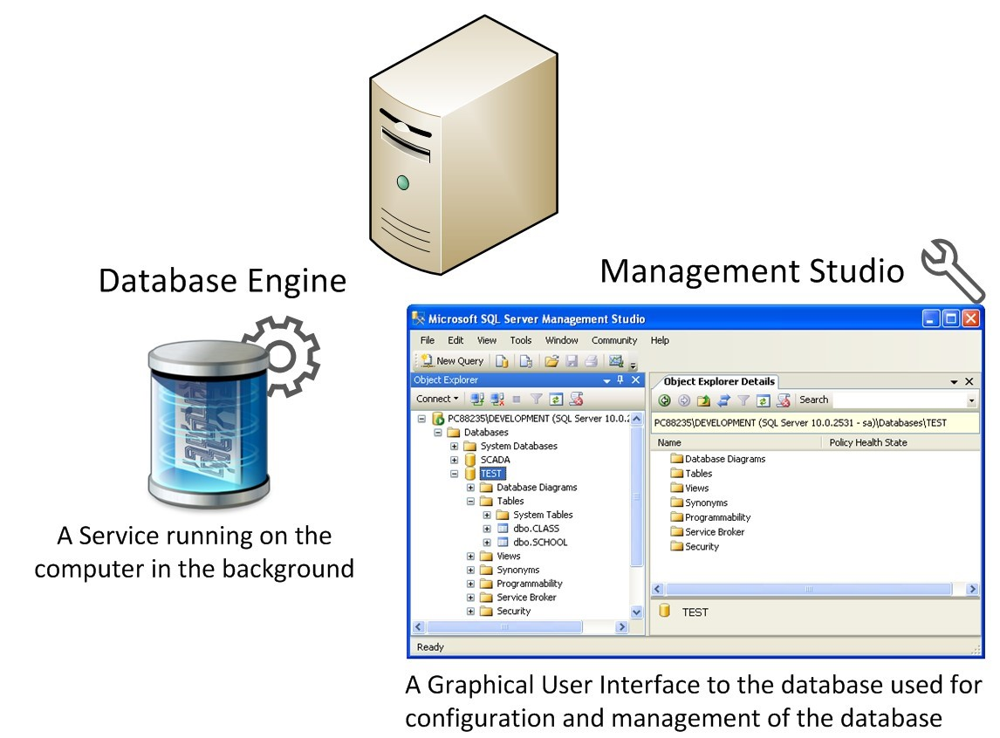
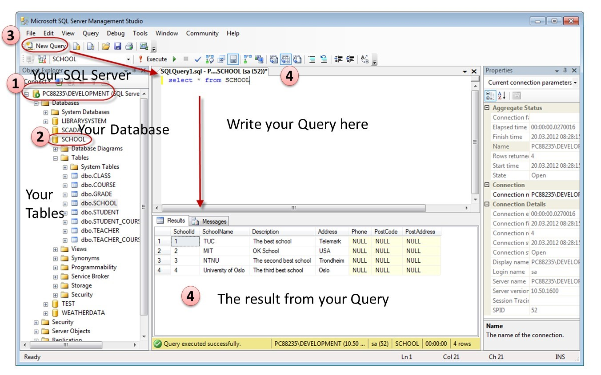
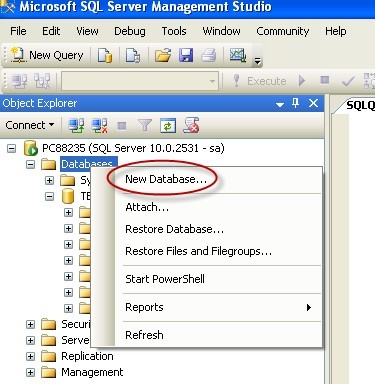
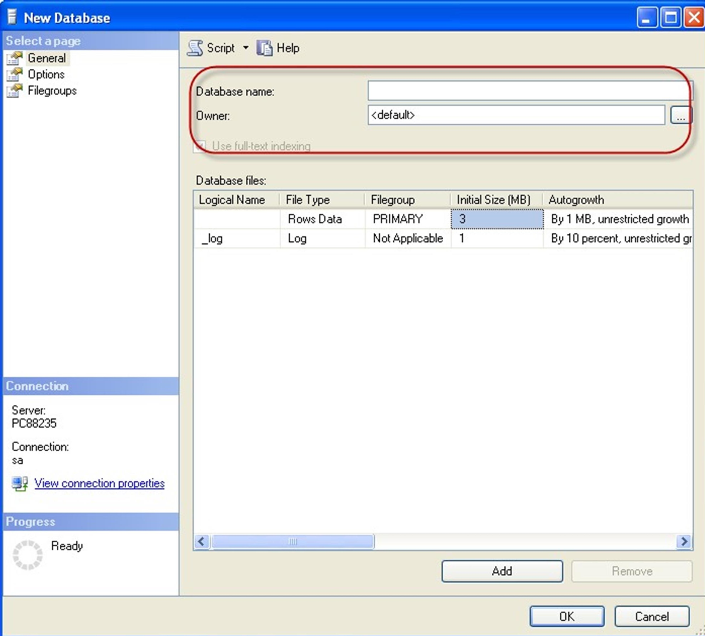
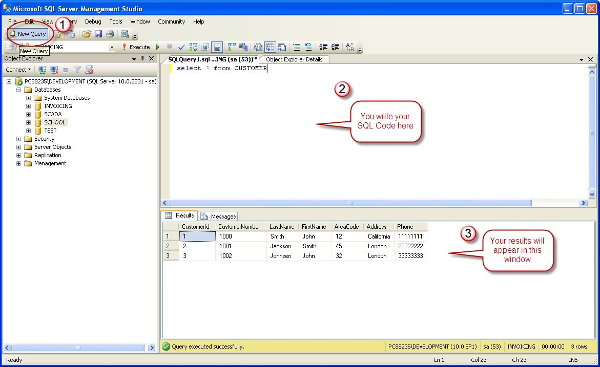

# Fundamentals of Database Management System (DBMS) Crash Course
## Week One

 Day 1: Introduction DBMS 

<blockquote> 

- [Video 1: Introduction about DBMS](https://www.youtube.com/watch?v=6Iu45VZGQDk&list=PLBlnK6fEyqRi_CUQ-FXxgzKQ1dwr_ZJWZ&index=1 "Introduction to Database Management System") 
</blockquote>

 Day 2: DBMS Characteristics 

<blockquote> 

 - [Video 1: DBMS Characteristics](https://www.youtube.com/watch?v=wClEbCyWryI&list=PLBlnK6fEyqRi_CUQ-FXxgzKQ1dwr_ZJWZ&index=2 "Characteristics of Database Management System") 
</blockquote>

 Day 3: DBMS Users 

<blockquote> 

 - [Video 1: DBMS Users](https://www.youtube.com/watch?v=qoAL4MA3P08&list=PLBlnK6fEyqRi_CUQ-FXxgzKQ1dwr_ZJWZ&index=3 "Characteristics of Database Management System") 
</blockquote>

 Day 4: Advantages and Disadvantages of DBMS 

<blockquote> 

 - [Video 1: DBMS Characteristics](https://www.youtube.com/watch?v=YcYF-kxE0Sw&list=PLBlnK6fEyqRi_CUQ-FXxgzKQ1dwr_ZJWZ&index=4 "Advantages and Disadvantages of Database Management System") 
</blockquote>

 Day 5: Fundamentals of Database System 

<blockquote> 

 - [Video 1: DBMS Characteristics](https://www.youtube.com/watch?v=qMAxQh6Xilo&list=PLBlnK6fEyqRi_CUQ-FXxgzKQ1dwr_ZJWZ&index=6 "Fundamentals of Database System") 
</blockquote>

 Day 6: Three-Schema Architecture & Data Independence 

<blockquote> 

 - [Video 1: DBMS Characteristics](https://www.youtube.com/watch?v=vuXnRRG-m5M&list=PLBlnK6fEyqRi_CUQ-FXxgzKQ1dwr_ZJWZ&index=7 "Three-Schema Architecture & Data Independence") 
</blockquote>

 Day 7: DBMS Languages, Interfaces & Classification and DB Environment 

<blockquote> 

 - [Video 1: DBMS Languages, Interfaces & Classification](https://www.youtube.com/watch?v=DkEMtOFMNQE&list=PLBlnK6fEyqRi_CUQ-FXxgzKQ1dwr_ZJWZ&index=8 "DBMS Languages, Interfaces & Classification") 
 - [Video 2: DB Environment](https://www.youtube.com/watch?v=rqcTHitakDM&list=PLBlnK6fEyqRi_CUQ-FXxgzKQ1dwr_ZJWZ&index=9 "Database Environment") 
</blockquote>

---

## Week Two

 Day 1: DBMS Architecture 

<blockquote> 

 - [Video 1: DBMS Architecture](https://www.youtube.com/watch?v=dftMGbbULhE&list=PLBlnK6fEyqRi_CUQ-FXxgzKQ1dwr_ZJWZ&index=10 "DBMS Architecture") 
</blockquote>

 Day 2: Basic Concepts of Entity-Relationship Model 

<blockquote> 

 - [Video 1: Basic Concepts of Entity-Relationship Model](https://www.youtube.com/watch?v=wOD02sezmX8&list=PLBlnK6fEyqRi_CUQ-FXxgzKQ1dwr_ZJWZ&index=11 "Basic Concepts of Entity-Relationship Model") 
</blockquote>

 Day 3: Database Design Process 

<blockquote> 

 - [Video 1: Database Design Process](https://www.youtube.com/watch?v=7m6gXeMDaHc&list=PLBlnK6fEyqRi_CUQ-FXxgzKQ1dwr_ZJWZ&index=12 "Database Design Process") 
</blockquote>

 Day 4: Concept of Relationships in ER Diagram 

<blockquote> 

 - [Video 1: Concept of Relationships in ER Diagram](https://www.youtube.com/watch?v=n3mHfQft5P8&list=PLBlnK6fEyqRi_CUQ-FXxgzKQ1dwr_ZJWZ&index=13 "Concept of Relationships in ER Diagram") 
</blockquote>

 Day 5: Exercises based on ER Model Concepts (Part 1) 

<blockquote> 

 - [Video 1: Exercises based on ER Model Concepts (Part 1)](https://www.youtube.com/watch?v=l9BRmq7pgZ8&list=PLBlnK6fEyqRi_CUQ-FXxgzKQ1dwr_ZJWZ&index=14 "Exercises based on ER Model Concepts (Part 1)") 
</blockquote>

 Day 6: Exercises based on ER Model Concepts (Part 2) 

<blockquote> 

 - [Video 1: Exercises based on ER Model Concepts (Part 2)](https://www.youtube.com/watch?v=BexmtjyRp6I&list=PLBlnK6fEyqRi_CUQ-FXxgzKQ1dwr_ZJWZ&index=15 "Exercises based on ER Model Concepts (Part 2)") 
</blockquote>

---

## Week Three

 Day 1: Introduction to Relational Data Model 

<blockquote> 

 - [Video 1: Introduction to Relational Data Model](https://www.youtube.com/watch?v=Q45sr5p_NmQ&list=PLBlnK6fEyqRi_CUQ-FXxgzKQ1dwr_ZJWZ&index=16 "Introduction to Relational Data Model") 
</blockquote>

 Day 2: Characteristics of Relations 

<blockquote> 

 - [Video 1: Characteristics of Relations](https://www.youtube.com/watch?v=J4hZbuTLyhI&list=PLBlnK6fEyqRi_CUQ-FXxgzKQ1dwr_ZJWZ&index=17 "Characteristics of Relations") 
</blockquote>

 Day 3: Relational Model Constraints 

<blockquote> 

 - [Video 1: Relational Model Constraints](https://www.youtube.com/watch?v=uPOGPL2C0_8&list=PLBlnK6fEyqRi_CUQ-FXxgzKQ1dwr_ZJWZ&index=18 "Relational Model Constraints") 
</blockquote>

 Day 4: Update Operations/Dealing with Constraint Violations 

<blockquote> 

 - [Video 1: Update Operations/Dealing with Constraint Violations](https://www.youtube.com/watch?v=lMthy1iwR3s&list=PLBlnK6fEyqRi_CUQ-FXxgzKQ1dwr_ZJWZ&index=19 "Update Operations/Dealing with Constraint Violations") 
</blockquote>

 Day 5: Exercises based on Relational Model (Part 1) 

<blockquote> 

 - [Video 1: Exercises based on Relational Model (Part 1)](https://www.youtube.com/watch?v=BZVWPsa08Jw&list=PLBlnK6fEyqRi_CUQ-FXxgzKQ1dwr_ZJWZ&index=20 "Exercises based on Relational Model (Part 1)") 
</blockquote>

 Day 6: Exercises based on Relational Model (Part 2) 

<blockquote> 

 - [Video 1: Exercises based on Relational Model (Part 2)](https://www.youtube.com/watch?v=xhohP0rZcB0&list=PLBlnK6fEyqRi_CUQ-FXxgzKQ1dwr_ZJWZ&index=21 "Exercises based on Relational Model (Part 2)") 
</blockquote>

---

## Week Four

 Day 1: Relational Algebra Operations - Unary 

<blockquote> 

 - [Video 1: Relational Algebra Operations - Unary](https://www.youtube.com/watch?v=8PJGw123zeE&list=PLBlnK6fEyqRi_CUQ-FXxgzKQ1dwr_ZJWZ&index=22 "Relational Algebra Operations - Unary") 
</blockquote>

 Day 2: Relational Algebra Operations - Set Theory 

<blockquote> 

 - [Video 1: Relational Algebra Operations - Set Theory](https://www.youtube.com/watch?v=r6OsT9Zi4Cg&list=PLBlnK6fEyqRi_CUQ-FXxgzKQ1dwr_ZJWZ&index=23 "Relational Algebra Operations - Set Theory") 
</blockquote>

 Day 3: Relational Algebra Operations - Binary 

<blockquote> 

 - [Video 1: Relational Algebra Operations - Binary](https://www.youtube.com/watch?v=sJtuZq-LEQM&list=PLBlnK6fEyqRi_CUQ-FXxgzKQ1dwr_ZJWZ&index=24 "Relational Algebra Operations - Binary") 
</blockquote>

 Day 4: Additional Relational Algebra Operations 

<blockquote> 

 - [Video 1: Additional Relational Algebra Operations](https://www.youtube.com/watch?v=4kqoN9-rqiQ&list=PLBlnK6fEyqRi_CUQ-FXxgzKQ1dwr_ZJWZ&index=25 "Additional Relational Algebra Operations") 
</blockquote>

 Day 5: Relational Algebra Queries (Part 1) 

<blockquote> 

 - [Video 1: Relational Algebra Queries (Part 1)](https://www.youtube.com/watch?v=Dgq01JAWw4Y&list=PLBlnK6fEyqRi_CUQ-FXxgzKQ1dwr_ZJWZ&index=26 "Relational Algebra Queries (Part 1)") 
</blockquote>

 Day 6: Relational Algebra Queries (Part 2) 

<blockquote> 

 - [Video 1: Relational Algebra Queries (Part 2)](https://www.youtube.com/watch?v=4y4tBfnPlS8&list=PLBlnK6fEyqRi_CUQ-FXxgzKQ1dwr_ZJWZ&index=27 "Relational Algebra Queries (Part 2)") 
</blockquote>

---

## Week Five

 Day 1: Basics of Structured Query Language (SQL) 

<blockquote> 

## Structured Query Language (SQL)
SQL is Structured Query Language, which is a computer language for storing, manipulating and retrieving data stored in a relational database.

SQL is the standard language for Relational Database System. All the Relational Database Management Systems (RDMS) like MySQL, MS Access, Oracle, Sybase, Informix, Postgres and SQL Server use SQL as their standard database language.

Also, they are using different dialects, such as-
- MS SQL Server using T-SQL,
- Oracle using PL/SQL,
- MS Access version of SQL is called JET SQL (native format) etc.

## Applications of SQL
As mentioned before, SQL is one of the most widely used query language over the databases. I'm going to list few of them here:
- Allows users to access data in the relational database management systems.
- Allows users to describe the data.
- Allows users to define the data in a database and manipulate that data.
- Allows to embed within other languages using SQL modules, libraries & pre-compilers.
- Allows users to create and drop databases and tables.
- Allows users to create view, stored procedure, functions in a database.
- Allows users to set permissions on tables, procedures and views.

## Features of SQL
- High Performance.
- High Availability.
- Scalability and Flexibility Run anything.
- Robust Transactional Support.
- Web and Data Warehouse Strengths.
- Strong Data Protection.
- Comprehensive Application Development.
- Management Ease.
- Open Source Freedom and 24 x 7 Support.
- Lowest Total Cost of Ownership.

## Components of DBMS Environment
A DBMS is software package used to design, manage, and maintain databases. Each DBMS should have facilities to define the database, manipulate the content of the database and control the database. These facilities will help the designer, the user as well as the database administrator to discharge their responsibility in designing, using and managing the database. It provides the following facilities:

1. Data Definition Language (DDL): it manages table and index structure. The most basic items of DDL are the CREATE, ALTER, RENAME and DROP statements: 
    - CREATE: creates an object (a table, for example) in the database.  
    - DROP: deletes an object in the database, usually irretrievably.  
    - ALTER: modifies the structure an existing object in various ways. For example, adding a column to an existing table.  

2. Data Manipulation Language (DML): is the subset of SQL used to add, update and delete data. 
The acronym CRUD refers to all of the major functions that need to be implemented in a relational database application to consider it complete. Each letter in the acronym can be mapped to a standard SQL statement: 
    - CREATE: inserts new data into a database.It's SQL is INSERT INTO.
    - READ (RETRIEVE): extracts data from a database. It's SQL is SELECT
    - UPDATE: updates data in a database. It's SQL is UPDATE
    - DELETE (DESTROY): deletes data from a database. It's SQL is DELETE

3. Data Query Language (DQL): it is a language for accessing or retrieving the data organized by the appropriate data model. Since the required data or Query by the user will be extracted using this type of language, it is also called "Query Language".
    - Procedural DQL:  user specifies what data is required and how to get the data.
    - Non-Procedural DQL: user specifies what data is required but not how it is to be retrieved

4. Data Dictionary (DD): Due to the fact that a database is a self describing system, this tool, Data Dictionary, is used to store and organize information about the data stored in the database.
5. Data Control Language (DCL): 
    - Database is a shared resource that demands control of data access and usage. The database administrator should have the facility to control the overall operation of the system.
    - Data Control Languages are commands that will help the Database Administrator to control the database.
    - The commands include grant or revoke privileges to access the database or particular object within the database and to store or remove database transactions.

</blockquote>

---

 Day 2: Introduction to SQL Server 

<blockquote> 

## SQL Server
Microsoft is the vendor of SQL Server. The newest version is “SQL Server 2012”.  
We have different editions of SQL Server, where SQL Server Express is free to download and use. 
SQL Server uses T-SQL (Transact-SQL). T-SQL is Microsoft's proprietary extension to SQL. T-SQL is very similar to standard SQL, but in addition it supports some extra functionality, built-in functions, etc. T-SQL expands on the SQL standard to include procedural programming, local variables, various support functions for string processing, date processing, mathematics, etc. 
SQL Server consists of a Database Engine and a Management Studio (and lots of other stuff which we will not mention here). The Database engine has no graphical interface - it is just a service running in the background of your computer (preferable on the server). The Management Studio is graphical tool for configuring and viewing the information in the database. It can be installed on the server or on the client (or both). 

## SQL Server Management Studio 
SQL Server Management Studio is a GUI tool included with SQL Server for configuring, managing, and administering all components within Microsoft SQL Server. The tool includes both script editors and graphical tools that work with objects and features of the server. As mentioned earlier, version of SQL Server Management Studio is also available for SQL Server Express Edition, for which it is known as SQL Server Management Studio Express. 
A central feature of SQL Server Management Studio is the Object Explorer, which allows the user to browse, select, and act upon any of the objects within the server. It can be used to visually observe and analyze query plans and optimize the database performance, among others. SQL Server Management Studio can also be used to create a new database, alter any existing database schema by adding or modifying tables and indexes, or analyze performance. It includes the query windows which provide a GUI based interface to write and execute queries. 

When creating SQL commands and queries, the “Query Editor” (select “New Query” from the Toolbar) is used (shown in the figure above). 
With SQL and the “Query Editor” we can do almost everything with code, but sometimes it is also a good idea to use the different Designer tools in SQL to help us do the work without coding (so much). 

## Create a new Database 
It is quite simple to create a new database in Microsoft SQL Server. Just right-click on the 
“Databases” node and select “New Database…” 

There are lots of settings you may set regarding your database, but the only information you must fill in is the name of your database: 

You may also use the SQL language to create a new database, but sometimes it is easier to just use the built-in features in the Management Studio.

## Queries 
In order to make a new SQL query, select the “New Query” button from the Toolbar. 

Here we can write any kind of queries that is supported by the SQL language. 

</blockquote>

